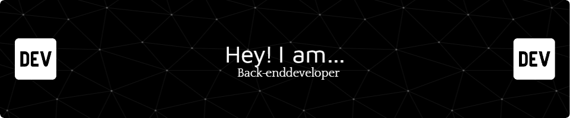

## Sobre Mim

- Me Chamo Mateus Marques
- Sou Estudante de Ciencias da Computacao no meu ultimo ano
- Tenho grande paixão pelo desenvolvimento Back-End.
- Meu foco principal é em Java com Spring, mas possuo experiência com outras linguagens.
-  **Dê-me uma ⭐**
-  **Obrigado pelo seu apoio!**

 
   
   
  

## Meus Projetos Favoritos
 

## Minhas Tecnologias

<table align="center">
    <tr>
        <td align="center">
            
             Java 
        </td>
        <td align="center">
            
             Spring Boot
        </td>
        <td align="center">
            
             PostgreSQL
        </td>
        <td align="center">
            
             Javascript
        </td>
        <td align="center">
            
             React
        </td>
    </tr>
</table>

## Contribuições
  
  
